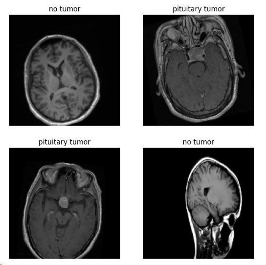
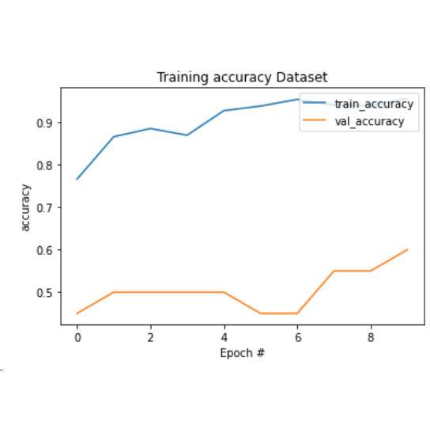
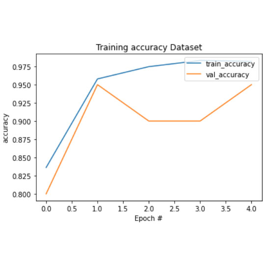

# Classifying Brain Tumor Images using CNN & Transfer Learning
**Hugo Hiraoka**

This is an image classifier that can distinguish Pituitary Tumor from "No Tumor" MRI Scan images.

The dataset used in this notebook is available for download from Kaggle.

Although this dataset actually has a total of 3,264 images belonging to 4 classes - Glioma Tumor, Meningioma Tumor, Pituitary Tumor and No Tumor, we will consider only taken two classes: Pituitary Tumor and No Tumor.

We will also reduce the dataset to 1000 images (830 training images and 170 Testing images). Our new training dataset, will take 395 MRI scans of No Tumor and 435 MRI scans of Pituitary Tumor.

Data Augmentation will be performed to prevent overfitting, and to make the model more generalised and robust.

This binary lassification model will be first implemented using CNN and then we will use transfer learning and compare performances.

In the future, with more processing power available, we will implement a multiple class model (considering the 4 classes) and use the entire dataset.

**Model Training accuracy:**

**Model Testing accuracy:**

